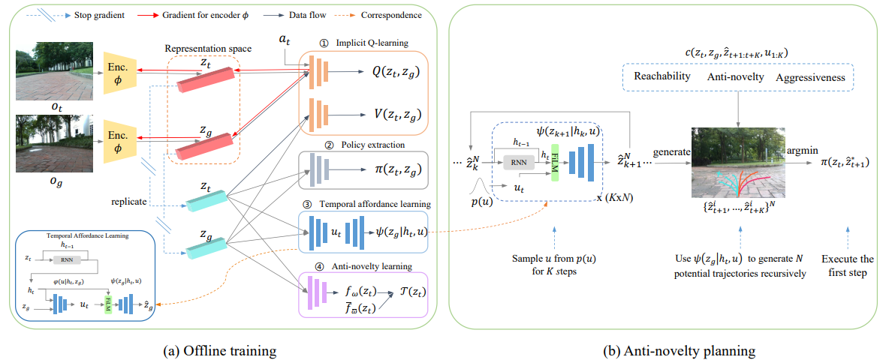

# ScaleNav
This is the reimplemented code of [*"(ICRA 2024) SCALE: Self-Correcting Visual Navigation for Mobile Robots via
Anti-Novelty Estimation"*](https://arxiv.org/pdf/2404.10675) by myself. The original code is owned by the company where I did the intern.


## Requirements
```python3
conda create -n scalenav python=3.8
pip install -r requirements.txt
```

## Dataset
The dataset should consist of:
 * an image directory with the timestamp as each image name, *e.g.*, timestamp.jpg.
 * a corresponding pose dict, *e.g.*, {timestamp:pose}, that is stored as a pickle file.

## Data preprocess
Specify the input dir: *raw_data_root* and output dir: *dataset_root* in custom.yaml.
```python3
cd /src/dataset/
python3 image_centercrop.py --input_images_dir xxx --output_images_dir xxx
python3 preprocess.py
```
After preprocessing, specify the data used for training to *train_data_dirs* in custom.yaml.


## Stage 1: Pretrain a vision encoder

```python3
python3 src/train_vqvae.py  --gpus 0 --log-dir logs/vqvae --env-name xxx --config-dir custom.yaml --image_goal
``` 
After pretraining, specify the pretrained model's path to *VQVAE.pretrained_path* in custom.yaml.


## Stage 2: Train IQL and affordance model together

```python3
python3 src/train_iql_custom.py --log-dir logs/train --env-name xxx --gpus 0 --config-dir custom.yaml --image_goal --rewards_type survival --use_film --diff_goal  --use_ln
```

To train ReViND: change --config-dir to revind.yaml and add --revind without --use_film, --diff_goal, and --use_ln parameters.


## Stage 3: Train a novelty estimator by RND

```python3
python3 src/train_RND.py --gpus 0 --log-dir logs/RND --env-name xxx --config-dir custom.yaml --image_goal
``` 
After training, specify the pretrained model's path to *RND.pretrained_path* in custom.yaml.

## Run navigation pipeline
```python3
python3 src/deployment.py   (optional: --no_ros)
```
## Cite
If you find our code or paper useful, please cite
```bibtex
@INPROCEEDINGS{chen2024scale,
  author={Chen, Chang and Liu, Yuecheng and Zhuang, Yuzheng and Mao, Sitong and Xue, Kaiwen and Zhou, Shunbo},
  booktitle={2024 IEEE International Conference on Robotics and Automation (ICRA)}, 
  title={SCALE: Self-Correcting Visual Navigation for Mobile Robots via Anti-Novelty Estimation}, 
  year={2024},
  volume={},
  number={},
  pages={16360-16366},
  keywords={Location awareness;Visualization;Q-learning;Navigation;Robustness;Robot localization;Trajectory},
  doi={10.1109/ICRA57147.2024.10610847}
}
```


